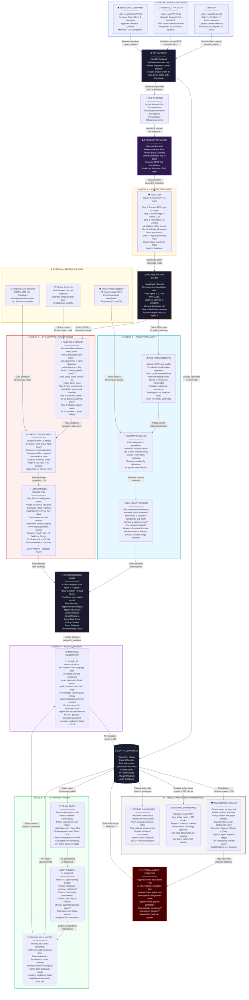

# ClaimHeart — Complete Architectural Flow Diagram

```mermaid
flowchart TD

    %% ─────────────────────────────────────────
    %% STAKEHOLDER ENTRY POINTS
    %% ─────────────────────────────────────────

    subgraph USERS["👥 STAKEHOLDER ENTRY POINTS"]
        P["🧑 PATIENT\n──────────\nLogs in via Web or App\nSelects: Cashless or Reimbursement\nUploads: Medical History,\nPrescriptions, Reports, ID Docs"]
        H["🏥 HOSPITAL / TPA STAFF\n──────────\nLogs in via TPA Portal\nUploads: Scanned Pre-Auth PDF\nFills: Patient Admission Info\nResponds: To Insurance Queries"]
        I["🛡️ INSURANCE COMPANY\n──────────\nLogs in via Insurer Portal\nReviews: Fraud Alerts & Decisions\nApproves / Rejects / Queries\nMonitors: TAT Compliance"]
    end

    %% ─────────────────────────────────────────
    %% API GATEWAY
    %% ─────────────────────────────────────────

    P -->|"Submits claim request\nwith documents"| APIGW
    H -->|"Uploads scanned PDF\npre-auth form"| APIGW
    I -->|"Reviews decisions\nraises queries"| APIGW

    APIGW["⚙️ API GATEWAY\n──────────\nFastAPI Backend\nAuthenticates user role\nRoutes request to correct pipeline\nAssigns unique Claim ID\nLogs every action with timestamp"]

    %% ─────────────────────────────────────────
    %% FILE STORAGE & DATABASE
    %% ─────────────────────────────────────────

    APIGW -->|"Saves raw uploaded\nPDF to file store"| FS
    APIGW -->|"Creates new claim\nrecord in DB"| DB

    FS["📁 FILE STORAGE\n──────────\nStores all raw PDFs:\nPre-auth forms\nDischarge summaries\nLab reports\nPrescriptions\nBilling documents"]

    DB[("🗄️ CENTRAL DATABASE\n──────────\nClaim ID + Status\nPatient Records\nPolicy Numbers\nExtracted Claim Data\nFraud Scores\nTAT Timestamps\nAll Agent Outputs\nAudit Trail Logs")]

    %% ─────────────────────────────────────────
    %% PII REDACTION LAYER
    %% ─────────────────────────────────────────

    FS -->|"Raw PDF passed\nfor redaction"| PII

    PII["🔒 PII REDACTION LAYER\n──────────\nMicrosoft Presidio\nMasks: Aadhaar, PAN,\nPhone, Email, Address\nBefore passing to any AI agent\nEnsures DPDP Act compliance\nProduces: Redacted PDF copy"]

    PII -->|"Redacted PDF\npassed to extraction"| EXT

    %% ─────────────────────────────────────────
    %% ORCHESTRATION LAYER
    %% ─────────────────────────────────────────

    EXT -->|"Structured JSON\nclaim data ready"| ORCH

    ORCH["🎯 ORCHESTRATION LAYER\n──────────\nLangGraph / CrewAI\nReceives structured claim data\nFires Agent 2, 3, 4 in PARALLEL\nWaits for all three to complete\nMerges all outputs into\nfinal unified claim decision\nPasses merged result to Agent 5"]

    %% ─────────────────────────────────────────
    %% AGENT 1 — EXTRACTOR
    %% ─────────────────────────────────────────

    subgraph AG1["📄 AGENT 1 — EXTRACTOR AGENT"]
        EXT["👁️ Vision LLM\nClaude Sonnet / GPT-4o Vision\n──────────\nStep 1: Convert PDF page to image\nStep 2: Feed image to Vision LLM\nStep 3: Prompt LLM to extract\nall fields in JSON format\nStep 4: Validate all required\nfields are present\nStep 5: Flag any missing field\nStep 6: Save structured JSON\nback to database"]
    end

    %% ─────────────────────────────────────────
    %% AGENT 2 — POLICY RAG
    %% ─────────────────────────────────────────

    subgraph AG2["📋 AGENT 2 — POLICY RAG AGENT"]
        VEMB["📥 VECTOR EMBEDDING\n──────────\nAll policy PDFs pre-loaded\nChunked into 400-token segments\nEach chunk embedded via\ntext-embedding model\nStored in Pinecone / ChromaDB\nIncludes: sub-limits, exclusions,\nwaiting periods, disease caps,\nroom rent limits, tariff rules"]

        VSEARCH["🔍 SEMANTIC SEARCH\n──────────\nClaim diagnosis + procedure\nconverted to query vector\nTop 5 most relevant policy\nchunks retrieved by similarity\nChunks re-ranked by relevance\nto specific claim details"]

        POLICYREAD["📖 LLM POLICY READER\n──────────\nLLM reads retrieved chunks\nAnswers: Is this covered?\nHow much is covered?\nWhat is the sub-limit?\nIs there a waiting period?\nAny exclusion clause?\nOutputs: Approved Amount,\nDenied Amount, Reason,\nSection Number, Page Number"]

        VEMB -->|"Policy chunks\nindexed and ready"| VSEARCH
        VSEARCH -->|"Relevant clauses\nretrieved"| POLICYREAD
    end

    ORCH -->|"Claim JSON sent\nfor policy matching"| VEMB

    POLICYREAD -->|"Policy decision\nwith citations"| MERGE

    %% ─────────────────────────────────────────
    %% AGENT 3 — FRAUD INVESTIGATOR
    %% ─────────────────────────────────────────

    subgraph AG3["🔎 AGENT 3 — FRAUD INVESTIGATOR AGENT"]
        RULES["⚡ FAST RULE ENGINE\n──────────\nRuns in milliseconds on every claim:\nRule 1: Duplicate claim check —\nsame patient ID + same diagnosis\nwithin 60 days = flag\nRule 2: Waiting period check —\nretail policy under 2 years old\n+ claim filed = reject\nRule 3: Test count check —\ntests billed vs protocol max/day\nRule 4: Sub-limit check —\nbill vs disease cap from policy\nRule 5: Multiple claims same\nPL/AL number = ghost billing"]

        STATS["📊 STATISTICAL ANOMALY\n──────────\nIsolation Forest ML Model\nFeatures: Cost, Days, Test Count\nTrained on historical claims\nCompares bill vs regional\ncost baseline table\nOutputs: Anomaly Score\nFlags if cost ratio > 3x average\nFlags if days > clinical norm"]

        LLMFRAUD["🧠 LLM SEMANTIC REASONING\n──────────\nOnly fires for ambiguous cases\nReads full clinical narrative:\nDischarge notes vs billing\nDiagnosis severity vs ICU days\nDoctor notes vs tests ordered\nPast claim history analysis\nPre-existing condition signals\nOutputs: Fraud Type List,\nEvidence Strings,\nConfidence Score 0-100,\nRecommendation: Approve /\nQuery / Reject / Dispatch Agent"]

        RULES -->|"Rule violations\npassed to stats layer"| STATS
        STATS -->|"Statistical flags\npassed to LLM"| LLMFRAUD
    end

    ORCH -->|"Claim JSON +\npast claim history"| RULES

    LLMFRAUD -->|"Fraud findings\nwith evidence"| MERGE

    %% ─────────────────────────────────────────
    %% AGENT 4 — TAT MONITOR
    %% ─────────────────────────────────────────

    subgraph AG4["⏱️ AGENT 4 — TAT MONITOR AGENT"]
        TIMER["🕐 CLAIM TIMER\n──────────\nRuns as background job\nevery 5 minutes continuously\nTracks elapsed time per stage:\nInitial Approval: 1 hour SLA\nDischarge Approval: 3 hour SLA\nReads timestamps from DB\nCalculates time remaining\nper active claim per stage"]

        BOTTLENECK["🔍 BOTTLENECK CLASSIFIER\n──────────\nWhen TAT approaching breach:\nChecks: discharge summary uploaded?\nChecks: open query unanswered?\nChecks: fraud flag in review?\nChecks: payment gateway status?\nClassifies exact delay reason\nAssigns ETA to resolution"]

        TATNOTIFY["📢 ESCALATION & NOTIFY\n──────────\nWarning at 15 mins remaining:\nNotifies hospital to upload docs\nBreach detected:\nEscalates to senior reviewer\nNotifies insurance company\nSends plain-language update\nto patient explaining delay\nLogs breach reason in audit trail"]

        TIMER -->|"TAT approaching\nor breached"| BOTTLENECK
        BOTTLENECK -->|"Bottleneck identified\nwith reason"| TATNOTIFY
    end

    DB -->|"Active claim\ntimestamps polled"| TIMER
    TATNOTIFY -->|"TAT status\nupdated in DB"| DB

    TATNOTIFY -->|"Delay reason\npassed to mediator"| MED

    %% ─────────────────────────────────────────
    %% MERGE POINT
    %% ─────────────────────────────────────────

    MERGE["🔀 DECISION MERGE POINT\n──────────\nCollects outputs from\nAgent 2 + Agent 3\nPolicy Decision + Fraud Score\nCombines into unified record:\nFinal Decision: Approve/Partial/Reject\nApproved Amount\nDenied Amount\nDenial Reasons\nFraud Risk Score\nPolicy Citation\nFraud Evidence\nRecommended Action"]

    MERGE -->|"Unified decision\npassed to mediator"| MED

    %% ─────────────────────────────────────────
    %% AGENT 5 — MEDIATOR
    %% ─────────────────────────────────────────

    subgraph AG5["💬 AGENT 5 — MEDIATOR AGENT"]
        MED["✍️ MESSAGE GENERATOR\n──────────\nLLM drafts all communications:\nFor Patient: Plain language letter\nin English or Hindi explaining\nexact approval / denial reason,\npolicy section cited, next steps\nFor Hospital: Formal query listing\nexact missing documents needed\nFor Insurance Co: Structured audit\nreport with full decision trail\nFor TAT Breach: Empathetic patient\nmessage explaining delay + ETA"]
    end

    MED -->|"All messages\nsaved to DB"| DB

    %% ─────────────────────────────────────────
    %% DASHBOARD OUTPUTS
    %% ─────────────────────────────────────────

    DB -->|"Patient claim data\nstatus + messages"| PD
    DB -->|"Hospital active cases\nqueries + TAT clocks"| HD
    DB -->|"Fraud alerts\ndecision queue + TAT"| ID

    subgraph DASH["📊 THREE STAKEHOLDER DASHBOARDS"]
        PD["👤 PATIENT DASHBOARD\n──────────\nReal-time claim status\nTimeline of every action\nPlain-language decision letter\nPolicy clause shown simply\nUpload additional documents\nAppeal option if rejected\nSMS + Push notifications"]

        HD["🏥 HOSPITAL DASHBOARD\n──────────\nUpload pre-auth PDF\nView active cases + TAT clocks\nRespond to insurer queries\nTrack initial + discharge approval\nSee what documents are missing\nGet alerts before TAT breach"]

        ID["🛡️ INSURER DASHBOARD\n──────────\nClaims sorted by fraud risk\nFull AI analysis per claim\nPolicy citation with page number\nFraud evidence with confidence score\nOne-click: Approve / Reject / Query\nPhysical agent dispatch trigger\nTAT compliance monitor panel\nAudit trail for every decision"]
    end

    %% ─────────────────────────────────────────
    %% PHYSICAL AGENT DISPATCH
    %% ─────────────────────────────────────────

    ID -->|"High fraud risk:\nDispatch triggered"| DISPATCH

    DISPATCH["🚗 PHYSICAL AGENT DISPATCH\n──────────\nTriggered when fraud score > 85\nor when digital verification fails\nInsurance field agent sent\nto hospital for on-ground check\nAgent verifies: patient admitted?\nTests actually conducted?\nDocuments genuine?\nReport filed back into system"]

    DISPATCH -->|"Verification report\nfiled back"| DB

    %% ─────────────────────────────────────────
    %% EXTERNAL REFERENCES
    %% ─────────────────────────────────────────

    subgraph EXT_REF["🌐 EXTERNAL REFERENCE DATA"]
        BASELINE["📈 Regional Cost Baseline\nIRDAI / CMS Fee Schedules\nAverage procedure costs\nby city and hospital tier"]
        PROTOCOLS["📋 Clinical Protocols\nMax tests per day per diagnosis\nExpected hospitalization days\nby diagnosis severity"]
        POLICYDB["📚 Policy Vector Database\nAll insurer policy PDFs\nPre-indexed and searchable\nPinecone / ChromaDB"]
    end

    BASELINE -->|"Cost reference\nfor anomaly check"| STATS
    PROTOCOLS -->|"Clinical norms\nfor test count check"| RULES
    POLICYDB -->|"Policy chunks\nfor semantic search"| VSEARCH

    %% ─────────────────────────────────────────
    %% STYLES
    %% ─────────────────────────────────────────

    style USERS fill:#f0f4ff,stroke:#4a6cf7,stroke-width:2px
    style AG1 fill:#fff7e6,stroke:#f0a500,stroke-width:2px
    style AG2 fill:#e6f7ff,stroke:#0099cc,stroke-width:2px
    style AG3 fill:#fff0f0,stroke:#cc0000,stroke-width:2px
    style AG4 fill:#f0fff4,stroke:#00aa44,stroke-width:2px
    style AG5 fill:#f9f0ff,stroke:#8800cc,stroke-width:2px
    style DASH fill:#f5f5f5,stroke:#333,stroke-width:2px
    style EXT_REF fill:#fffbe6,stroke:#e6b800,stroke-width:2px

    style APIGW fill:#1a1a2e,color:#fff,stroke:#4a6cf7
    style DB fill:#1a1a2e,color:#fff,stroke:#00aa44
    style ORCH fill:#1a1a2e,color:#fff,stroke:#f0a500
    style MERGE fill:#1a1a2e,color:#fff,stroke:#cc0000
    style PII fill:#2d1b4e,color:#fff,stroke:#8800cc
    style DISPATCH fill:#4a0000,color:#fff,stroke:#cc0000
```
